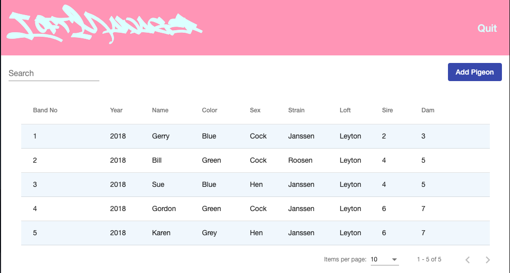
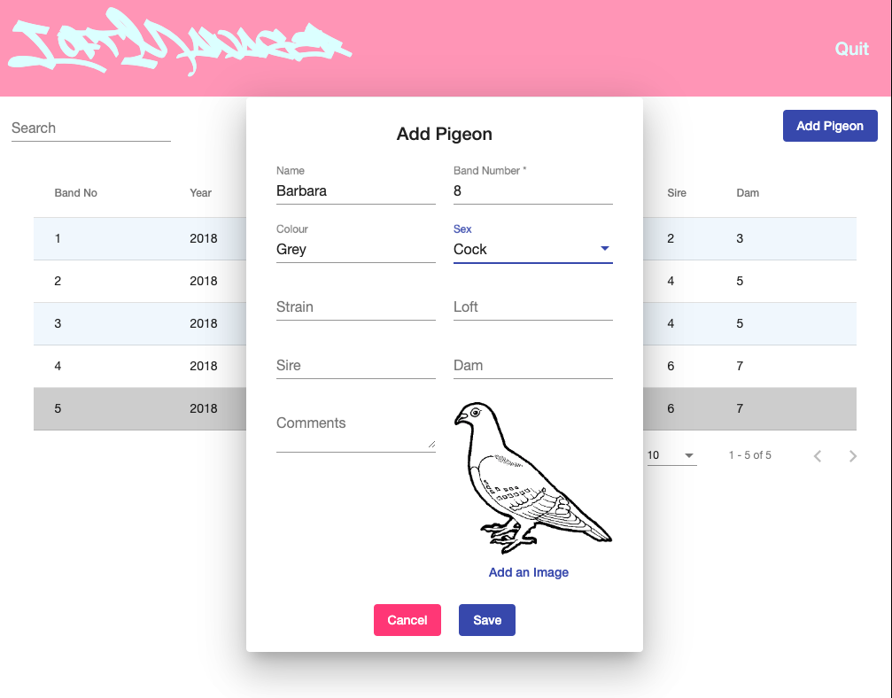
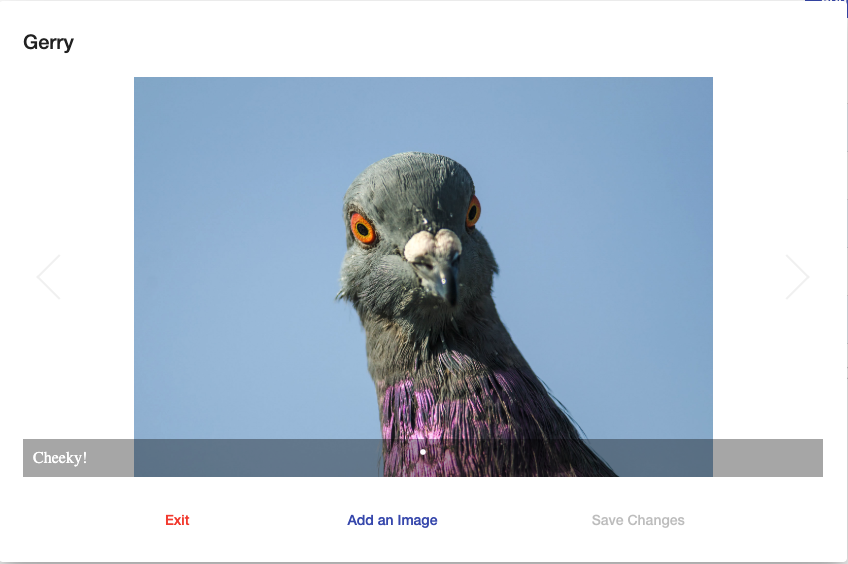
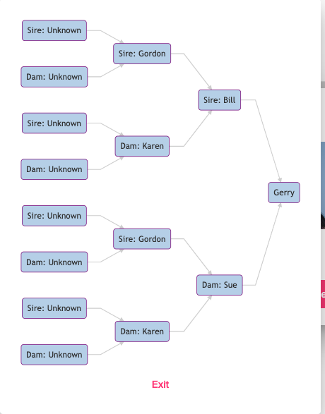

# LoftManager

Loft Manager is a fullstack web app for managing pigeon lofts. It was built with Angular and Graphcool. Authorisation is handled by Auth0, styling by Angular Material and MermaidJS.
Loft Manager was commissioned by Jon Day, the author of a fantastic book about homing pigeons called <em>Homecoming</em>.

## User Stories
Loft Manager satisfies the following user stories:

`As a pigeon fancier` 
`So that I can keep track of my pigeons` 
`I want to be able to display their details in a table`

`As a pigeon fancier` 
`So that I can keep track of new pigeons`
`I want to be able to add new pigeons to the database`

`As a pigeon fancier` 
`So that I can store and view images of my favourite birds` 
`I want to be able to upload images easily and see them in a media carousel`

`As a pigeon fancier` 
`So that I can remind myself of my pigeons' pedigree`
`I want to be able to display their genealogy in a nice diagram`

